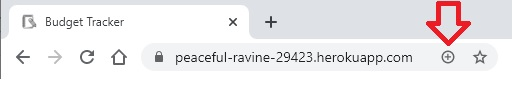

# Online-or-Offline-Budget-Tracker

## Description:
This project is a node server based Heroku app using MongoDB! It is also a Progressive Web App. You can install the application from the browser and use it without internet connection. Then, when you have internet connection again, your data will be automatically uploaded to the site via IndexDB.
   
## Table of Contents:
* [Installation](#installation)
* [Usage](#usage)
* [Questions](#questions)

## Installation
Click the plus icon 

## Usage
This is a very simple app. You enter the name of the transaction, transaction amount, then Add/Subtract funds. You can even go into the negative if you choose to do so. 

## Questions
Visit my Github page [jacobhoss](https://github.com/jacobhoss)
For any questions, please contact me at jacobhenryhoss2@gmail.com 

## Visit the URL on Heroku to try it out!

[Heroku App](https://peaceful-ravine-29423.herokuapp.com/)